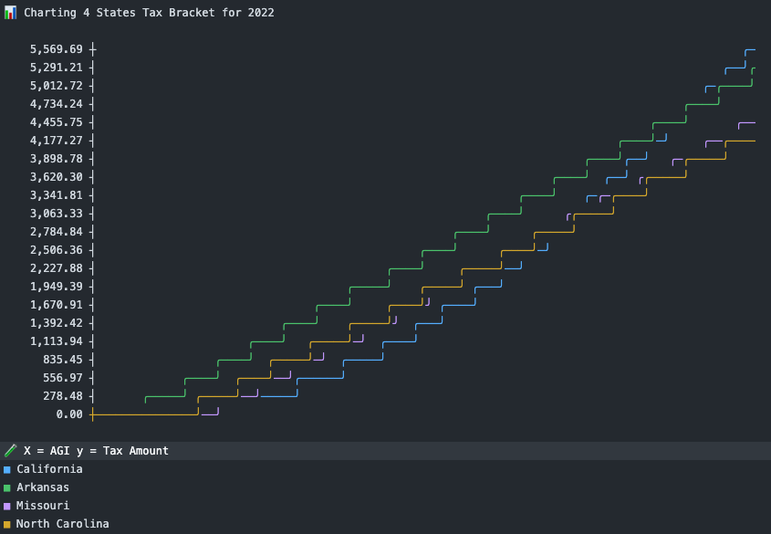
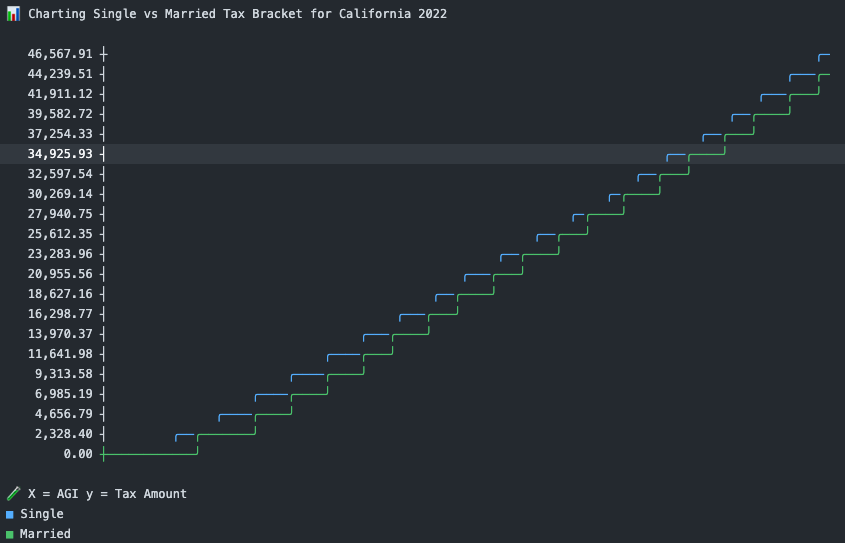

📜 The API's are intentionally compatible with [Google Sheets App Scripts][gsas]. 📜

# 💰 Tax Planning

This toolchain is designed to assist individuals with long-term tax planning
strategies, such as a Roth conversion ladder and predicting tax liability over
their lifetime.


## 🌺 Table of Contents

* [🧪 Examples](#-examples)
  * [🏦 Portfolio Examples](#-portfolio-examples)
  * [💱 Tax Examples](#-tax-examples)
* [🚀 Use Cases](#-use-cases)
* [⌨️  Local Development](#%EF%B8%8F--local-development)

## 🧪 Examples

### 🏦 Portfolio Examples

Given a list of individual purchases (called Stonks) you can emulate tax
planning strategies on a specific portfolio.

```js
const { Portfolio } = require('taxPlanning.js')

const portfolio = new Portfolio([
  new Stonk({ value: 10, gains: 0, shares: 10 }),
  new Stonk({ value: 10, gains: 8, shares: 10 }),
  new Stonk({ value: 10, gains: -10, shares: 10 }),
])

// we want to withdraw $20 and tax-loss harvest as much as possible
// more specific ratios can be picked to control taxes loss/gains in withdraws
const withdraw = portfolio.withdraw(20, -1.0)

// withdraw includes 2 full stonks
console.log(withdraw.value) // 20

// withdraw includes the lowest gains
console.log(withdraw.gains) // -10
```

### 💱 Tax Examples

A comprehensive example of Federal and State tax bracket combinations exist
inside of `./test/fullTaxYearAmount.js`.

#### 🏦 Tax Amount

Calculate the tax amount based on a value and a range of tax brackets.

```js
const tp = require('taxPlanning.js')
const simpleTaxBracket = [
    [    0,  10_000, 0.00],
    [10_000, 25_000, 0.10],
    [25_000,   null, 0.20],
]
console.log(
    tp.taxAmount(30_000, simpleTaxBracket)
)
// => 2_500.00
```

#### 🚕 Tax Basis

Given an amount, it'll return the basis that would result in `amount` if you included tax.

```js
const tp = require('taxPlanning.js')
const simpleTaxBracket = [
    [    0,  10_000, 0.00],
    [10_000, 25_000, 0.10],
    [25_000,   null, 0.20],
]
console.log(
    tp.taxBasis(15_000, simpleTaxBracket)
)
// => 14_545.45
```

#### 🛋️ Append Deduction to Bracket

Instead of subtracting your standard deduction, craft a new tax bracket set with a standard deduction built in.

```js
const tp = require('taxPlanning.js')
const simpleTaxBracket = [
    [    0,  10_000, 0.00],
    [10_000, 25_000, 0.10],
    [25_000,   null, 0.20],
]
console.log(
    tp.appendDeductionToBracket(5_000, simpleTaxBracket)
)
/*
=> [
  [     0, 15_000, 0.00],
  [15_000, 30_000, 0.10],
  [30_000,   null, 0.20],
]
*/
```

#### 🧲 Merge Tax Brackets

Merge two tax brackets into one bracket.

```js
const tp = require('taxPlanning.js')
const simpleFederal = [
    [    0,  10_000, 0.00],
    [10_000, 25_000, 0.10],
    [25_000,   null, 0.20],
]
const simpleState = [
    [     0, 15_000, 0.01],
    [15_000, 25_000, 0.02],
    [25_000, 50_000, 0.03],
    [50_000,   null, 0.04],
]
console.log(
    tp.mergeTaxBrackets(simpleFederal, simpleState)
)
/*
=> [
    [     0, 10_000, 0.01],
    [10_000, 15_000, 0.11],
    [15_000, 25_000, 0.12],
    [25_000, 50_000, 0.23],
    [50_000,   null, 0.24],
]
*/
```

#### 🧱 Stack Tax Brackets

Stack two tax brackets on a pivot. It's common to pivot on ordinary income,
while stack capital gains income on top.

```js
const tp = require('taxPlanning.js')
const ordinaryIncome = 25_000
const simpleIncome = [
    [     0, 15_000, 0.01],
    [15_000, 25_000, 0.02],
    [25_000, 50_000, 0.03],
    [50_000,   null, 0.04],
]
const simpleCapGains = [
    [     0, 10_000, 0.00],
    [10_000, 25_000, 0.10],
    [25_000,   null, 0.20],
]
console.log(
    tp.stackTaxBrackets(
        ordinaryIncome,
        simpleIncome,
        simpleCapGains
    )
)
/*
=> [
    [     0, 15_000, 0.01],
    [15_000, 25_000, 0.02],
    [25_000,   null, 0.20],
]
*/
```

#### 📏 Amount By Rate

```js
const tp = require('taxPlanning.js')
const goalEffectiveTaxRate = 0.20
const taxBracket = [
  [      0,  10_275, 0.10],
  [ 10_275,  41_775, 0.12],
  [ 41_775,  89_075, 0.22],
  [ 89_075, 170_050, 0.24],
  [170_050, 215_950, 0.32],
  [215_950, 539_900, 0.35],
  [539_900,    null, 0.37]
]

const toWithdraw = tp.amountByRate(goalEffectiveTaxRate, taxBracket)

console.log(toWithdraw) // 154_099.75
console.log(tp.taxRate(toWithdraw, taxBracket)) // 0.20
```

##### 📐 Complex Amount By Rate

```js
const goalEffectiveTaxRate = 0.14
const capitalGainsIncome = 50_000
const incomeTax = [
  [    0,  10_000, 0.00],
  [10_000, 25_000, 0.10],
  [25_000,   null, 0.20],
]
const capitalGainTax = [
  [    0,  40_000, 0.00],
  [40_000, 85_000, 0.01],
  [85_000,   null, 0.02],
]

const toWithdraw = tp.complexAmountByRate(
  goalEffectiveTaxRate,
  capitalGainsIncome,
  incomeTax,
  capitalGainTax
)

const taxBracket = tp.stackTaxBrackets(
  toWithdraw,
  incomeTax,
  capitalGainTax
)
const agi = toWithdraw + capitalGainsIncome
const actualRate = tp.taxRate(agi, taxBracket)

console.log(toWithdraw) // 158_203.50
console.log(actualRate) // 0.14
```

## 🚀 Use Cases

### 🚵 Full Tax Year

This demonstrates how you could combine multiple brackets into a single set,
which you can use to generate the tax amount for various scenarios.

[💡 View the full Example][example]

```js
const tp = require('taxPlanning.js')

// snippet from `./test/fullYearTaxAmount.js`
const federalTaxBracket = tp.stackTaxBrackets(
  ordinaryIncome,
  tp.appendDeductionToBracket(
    federalDeduction,
    federalInomeTaxes
  ),
  tp.appendDeductionToBracket(
    federalDeduction,
    tp.mergeTaxBrackets(
      federalCapGainsTax,
      federalNiit
    )
  )
)
const stateTaxBrackets = tp.stackTaxBrackets(
  ordinaryIncome,
  tp.appendDeductionToBracket(
    californiaDeduction,
    californiaIncomeTax
  ),
  tp.appendDeductionToBracket(
    californiaDeduction,
    californiaCapGainsTax
  )
)
const combinedTaxBrackets = tp.mergeTaxBrackets(
  federalTaxBracket,
  stateTaxBrackets
)
const actualAmount = tp.taxAmount(
  agi,
  combinedTaxBrackets
)
```

### 🛣️ Compare States

[](./test/compareStates.js)

### 💍 Compare Brackets

[](./test/compareBrackets.js)

## ⌨️  Local Development

Requires node v19.4 or greater.

```
git clone git@github.com:mxbaylee/taxPlanning.js.git
npm install
npm test
```

[example]:test/fullYearTaxAmount.js
[gsas]:https://developers.google.com/sheets/api/quickstart/apps-script
